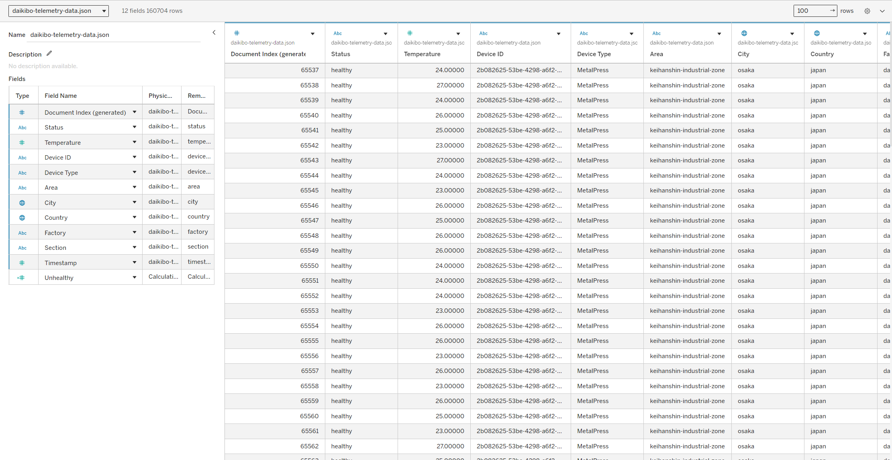
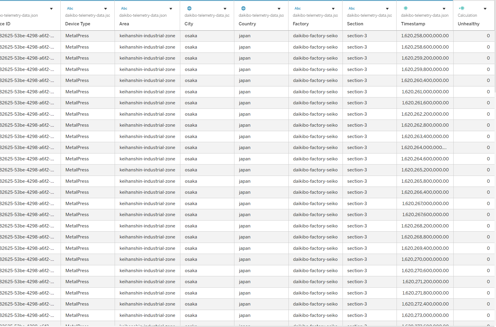
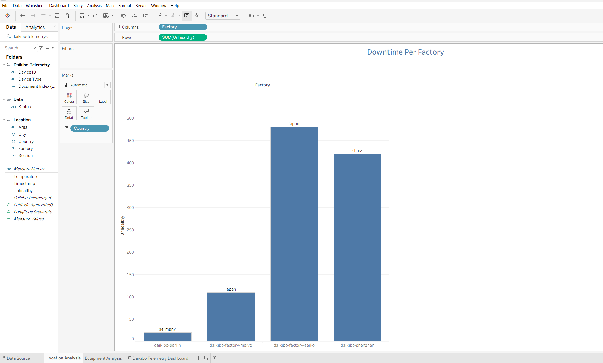
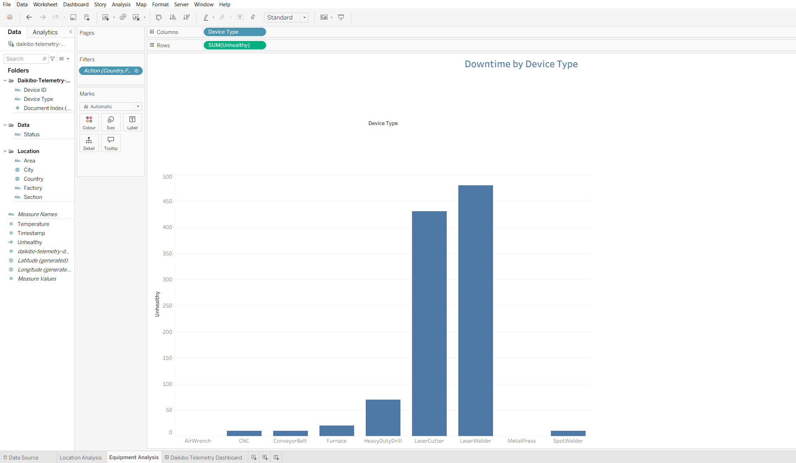
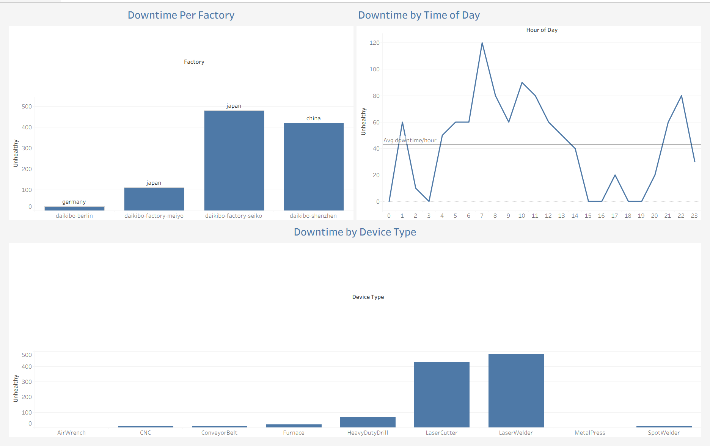

# Daikibo Industrials: Telemetry Downtime Analysis
**Deloitte Australia Data Analytics Job Simulation** (via Forage)

This project analyses IoT telemetry data from four Daikibo Industrials factories to identify where machines break most and why. The dataset covers 160,000+ readings collected across May 2021, with one record every 10 minutes per machine.

The tool used is Tableau. The data came as a single JSON file.

---

## The Data

Each row is a machine status reading. The fields that matter most for this analysis are `factory`, `deviceType`, `status` (healthy/unhealthy), `section`, `timestamp` (Unix milliseconds), and `temperature`. The `status` field was converted into a calculated field called **Unhealthy** (10 if unhealthy, 0 if healthy) to quantify downtime in minutes, since readings are sent every 10 minutes.

---

## Where Machines Break Most

Daikibo Factory Seiko in Osaka has the highest downtime by a significant margin, followed by the Shenzhen factory. Berlin is close to zero by comparison. This answers the first question the client asked: __In which location did machines break the most?__

---

## What Breaks Most

LaserWelders and LaserCutters account for the bulk of failures across all factories. The gap between these two and every other device type is hard to miss. Combined with the factory-level finding, this points to a specific maintenance priority: LaserWelders and LaserCutters at Daikibo Seiko.

---

## When Failures Happen (Extended Analysis)

Going beyond the required brief, I converted the Unix timestamps to extract the hour of each failure. The goal was to see whether breakdowns cluster at specific times, which would have operational implications beyond just knowing *what* breaks.

Failures spike sharply at **07:00**, reaching nearly three times the hourly average. There are secondary peaks around 10:00 and again at 22:00, while the mid-afternoon window (15:00-19:00) is almost flat. The most likely explanation for the 07:00 spike is cold-start stress at morning shift startup. Machines going from idle to full load simultaneously, without adequate warm-up, puts more strain on high-tolerance equipment like laser systems.

The practical takeaway: maintenance checks and warm-up procedures for LaserWelders and LaserCutters should happen *before* the 07:00 shift start

---

## Tools
- Tableau (data connection, calculated fields, dashboard)
- JSON source data (not included in this repo due to file size)

---

## Notes
The temperature field was also explored as a potential failure predictor. All machine types clustered between 23-25°C regardless of status, so there was nothing meaningful to report there. It is worth noting because knowing when an avenue is not worth pursuing is part of the analysis too.
